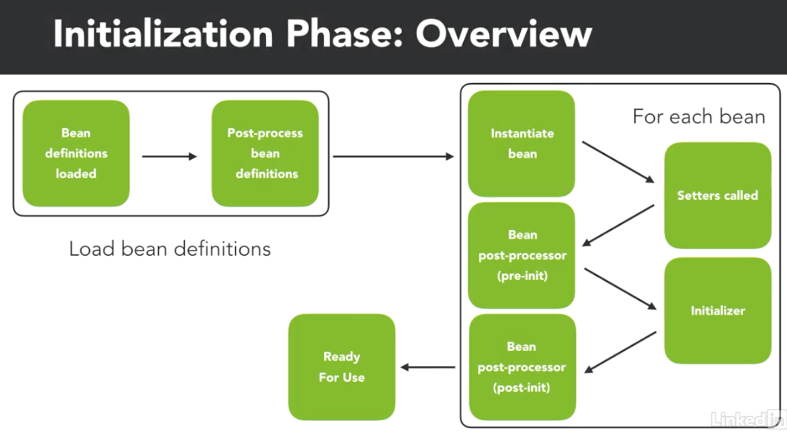

## Q&A

### Caused by: org.springframework.beans.factory.BeanCurrentlyInCreationException: Error creating bean with name 'messageDispatcher': Bean with name 'messageDispatcher' has been injected into other beans [miniAppServiceBean] in its raw version as part of a circular reference, but has eventually been wrapped. This means that said other beans do not use the final version of the bean. This is often the result of over-eager type matching - consider using 'getBeanNamesOfType' with the 'allowEagerInit' flag turned off, for example.

https://blog.csdn.net/Jas000/article/details/78106804

问题出现的原因：简单的讲就是在启动程序的时候，Spring已经对DealerService里的asyncUpdate、userService加载完成，当准备创建AsyncUpdate类的时候发现使用了@Async注解，即spring又需将该Bean代理一次，然后Spring发现该Bean已经被其他对象注入，这里就是问题的关键所在了。

@Lazy

@Autowired


## Tips

#### 监听服务启动

```java
implements ApplicationListener<ApplicationReadyEvent>
```


#### @Scheduled

cron表达式 定时任务注解

https://blog.csdn.net/qq_39101581/article/details/79308851


#### @Async

方法异步，调用方和被调用方不能在同一个类里


## Spring 5.0 and Spring Boot 2.0 New Features

**Introduction**

- New features of Spring and Spring Boot
- What you need to know

**1. Spring Core Changes**

- Java baseline

    spring5最低的jdk是java8、java ee1.7

    spring5.1将支持java11

    

- Removed packages and classes

    升级到了hibernate5

    删掉了 velocity

    删掉了 XMLBeans

    删掉了 Guava

    

- IO

    改成非阻塞的了

    增加了 isFile() 方法

    readable channel -- nio

    general file system access --nio

    

- XML configuration

- Nullable annotation

    @Nullable @NonNullApi

    

**2. Spring Web Changes**

- Servlets

    全面支持 servlet3.1

    有了pushbuilder，要求servlet4.0 tomcat9；可以减少加载时间，对于电商是很好的

    

- Immutable binding

    帮助保护对象，比如dto

    

- JSON and Protobuf

    升级 jackson 3.9, protobuf 3

    

- Exception and response status

    exceptionhandler 可以添加一个redirect了

    ResponseStatusException @ResponseStatus

    

- Reactive spring

    Reactor3.1 Flux Mono

    RxJava3.1 2.1

    

    webclient 非阻塞的流，淘汰了AsyncRestTemplate

    

    spring-webflux vs spring-mvc

    @webflux-controller

    支持undertow netty

    webflux.fn

    

**3. Spring Test Changes**

- Jupiter support

    全面支持Jupiter

    junit5

    不支持@RunWith，支持@ExtendsWith

    SpringExtension.class

    

    springJUnitConfig

    @ExtendsWith(SpringExtension.class) ->Jupiter

    @ContextConfiguration -> Spring

    

    springJUnitWebConfig

    springJUnitConfig + WebApplicationContext

    

    conditional running

    @EnabledIf @DisabledIf

    

- Parallel test execution

    Jupiter5.3 是并行测试的一个试验

    plugin surefire

    

- Mocks

**4. Spring Boot**

- Library upgrades

    最低jdk8

    最低spring5

    tomcat升级到8.5

    flyway5

    hibernate5.2

    thymeleaf3

    

- Configuration property changes

- Actuator changes

- Micrometer

- Other changes

**Conclusion**

- Next steps


## Learning Spring with Spring Boot

**Introduction**

- Welcome
- What you need to know
- Working with exercise files

**1. Getting Started with Spring Boot**

- Introduction to Spring

    JavaBean：只有属性、getter、setter；如DTO

    POJO：有属性和方法

    

- Welcome to Spring Boot

- Create a project with Spring Initializr

- Examine the Spring Boot skeleton project

**2. Data Access**

- Spring Boot: Embedded database and configuration

    schema.sql DDL

    data.sql DML

    

- Welcome to Spring Data

- Build your first Spring Data Repository with Spring Data JPA

**3. The Service Tier**

- Build a service abstraction

- Develop a service object with Spring

    web

    ​	dto

    ​	application

    business

    ​	domain

    ​	service

    data

    ​	entity

    ​	repository

    

**4. Web Pages with Spring**

- Introduction to the controller
- Build our first controller
- Thymeleaf as a rendering engine
- Put it all together
- Test a controller MockMvc

**5. Exposing Our Services through RESTful Endpoints**

- RestController
- Expose a service layer through REST

**Conclusion**

- Summary of the web application


## Spring: Framework In Depth

**Introduction**

- Welcome

    Ioc、configuration、spring lifecycle、aspect

    

- What you need to know

- Working with exercise files

**1. Spring Overview**

- Introduction to Spring

- The IoC container

    在runtime实现的控制反转

    ​	减少代码的噪音

    ​	代码解耦

    ​	减少犯错

    ​	聚焦在api契约上

    

**2. Configuring the Application Context**

- Introduction to the ApplicationContext

    applicationContext 是只读的 beanFactory

    通常有多个context

    

- Configuration of Spring with Java

    java config的好处：

    ​	java开发用java，不用xml

    ​	编译期间可以检查配置

    ​	IDE集成方便

    

    @Configuration

    ​	@Bean 在方法上，方法只会执行一次；bean方法的参数，如果也是本文件里的bean，会自动注入；

    ​						如果不是，需要创建一个属性，然后autowire，然后@Import(XxxConfig.class)；

    ​						多个配置文件import到一个config文件里

    ​	@Value

    

    建立一个config的包，里面是Appconfig.java

    

- Encapsulate configurations

    根据用途将config文件拆分成多个

    DataConfig

    

- Work with the environment

    可以把spring property autowire进来，然后get变量

    @PropertySource("classpath:/application.properties") 在类上

    @Value("${greeting.txt}") 在属性上

    如果同时在文件和env里有同样的属性，那么env里的优先级高

    

- Profiles

    @Profile("prod") @Profile("dev") 在bean方法上，两个返回值一样的bean，名字不同

    spring.profiles.active=dev

    然后执行，会根据active来决定初始化哪一个bean

    

- Spring expression language

    SpEL比profile要强大的多

    @PropertySource("classpath:/application-${spring.profiles.active}.properties") 在类上

    

    @Value("#{new Boolean(environment['spring.profiles.active']=='dev')}")

    peivate boolean isDev;


- Bean scopes

    Singletons：默认的；一个context里只实例化一个；小心静态变量

    Session：一个user session一个实例

    Request：一个request一个实例

    Prototype：每次都实例化

    @Scope("singleton")

    

- Proxies

    从spring4.0开始，每个bean都至少有一个proxy

    JDK：基于接口模型

    CGLIB：基于子类模型

    只能对public的方法做代理

    

**3. Annotation-Based Configuration**

- The component scan

    @component @controller @service @repository

    @autowire @qualifier

    需要有一个java config或者xml 配置

    在@configuration配置中会定义基础包路径@ComponentScan(basePackages = {"com.wangrollin"})

    在启动的时候扫描

    

    configuration用来定义外部的类的bean初始化

    component用来定义自己的类的初始化

    

    在component的构造函数上加autowire，可以自动注入参数bean


- Autowire beans

    私有变量 autowire，尽量少，因为Junit不能通过public方法访问

    setter autowire，尽量少，因为别人可以调用setter

    构造函数 autowire，推荐的做法，private final，内部属性不可变

    

- Lifecycle methods

    在启动的阶段，proxy不一定有效

    不能在构造函数里调用repo的proxy

    不能在实例解构的时候依赖spring

    

    这是最早可以使用spring proxy的时机；
    在所有属性都被设置好之后，spring准备好了，就会调用这个方法
    此时可以用依赖项以及它们的proxy

    ```java
    @PostConstruct 
    public void init() {} 
    
    @PreDestroy
    public void destroy() {} 
    ```

    

**4. XML-Based Configuration**

- Why XML-based configuration is still important

    element, attribute, namespace

    

- XML configuration of beans

    ```xml
    <bean id="cusRepository" class="com.wangrollin.XX"/>
    
    <bean id="xxxService" class="com.wangrollin.XxxServiceImpl">
    	<constructor-arg name="cusRepository" ref="cusRepository" />
        <constructor-arg name="cusRepository" ref="cusRepository" />
    </bean>
    ```

    

- XML namespaces

    好处：减少配置工作

    Util Namespace

    JEE Namespace: JNDI

    JDBC Namespace: 

    其他的常用namespace：JMS, TX(transactions), AOP, Context

    

**5. Bean Lifecycle**

- Why the lifecycle is so important

- The overall picture

    三个阶段：

    Initialization：从applicationcontext开始，beanfactory，bean

    

    use

    destruction

    

- The initialization phase: Loading bean definitions

    bean定义的来源：java config、xml config、componentScan、autoconfiguration

    这些bean定义都加载到了beanfactory里

    id是用来给factory做index的

    此时beanfactory只包含引用

    

- The initialization phase: Bean factory post-processing

    最经典的例子是：PropertySourcePlacehodlerConfiguror

    BeanFactoryPostProcessor interface，可以创建自己的processor，用static方法，这是第一个可定制的点

    所有bean的metadata都设置好了

    

- The initialization phase: Bean instantiation

    bean在factory中用构造方法实例化，bean之间按照依赖的顺序，单例的bean在factory中留下了handle

    构造函数级别的autowire在此时注入

    eager、lazy：默认是eager，只有显示声明为lazy并且没有bean依赖它才可以lazy

    可以声明为lazy，但是applicationcontext保留无视的权力

    对象已经初始化了，但是还不能使用

    

- The initialization phase: Setters

    setter-based and field-based autowiring 在这时注入

    但是java config有所不同，在这个阶段不做事情

    

    所有的依赖都注入好了，但是还不能用

    

- The initialization phase: Bean post-processing

    三个阶段都是bean post-processing

    initializer：@PostConstruct被调用，spring自己的也被调用，

    ​					BeanPostProcessor interface 是第二个可定制的点，可以注入行为

    ​								两种：before、after，pre-init, post-init

    

- The initialization phase: Differences based on configuration types

    java config：实例化和setter阶段合并在了实例化阶段里，因为在使用@Bean的时候，相当于已经告诉了spring怎么处理依赖顺序

    autoconfig：取决于bean的定义方式，先走一遍构造函数的autowire，再走一遍setter和属性的aotuwire

    

- The use phase

    只能在contxt里访问自己的bean，保留的不可以访问

    如果一定要访问，那就 ApplicationContextAware interface

    

- The destruction phase

    @PreDestroy 被调用

    然后解除饮用，GC之后会回收

     

**6. Aspect Oriented Programming**

- Aspecting in Spring

    AspectJ for Aspecting

    运行时织入，修改字节码

    join point（某个方法），point cut（匹配表达式），advice（添加的行为代码），

    aspect（包含point cut和advice）

    

- Define AOP pointcuts

    designator("r p.c.m(arg)")

    在什么包下，寻找某种方法

    某个包下的所有方法

    某个包下的某种返回值的方法

    具有某个注解的方法

    ```java
    @Target(ElemenmtType.METHOD)
    @Retention(RetentionPolicy.RUNTIME)
    public @interface Loggable {}
    // 什么时间什么地点
    
    @Component
    @Aspect
    public class LoggableAspect {
        
        @Pointcut("@annotation(Loggable)")
        public void exeuteLogging() {
            
        }
        
        @Before("exeuteLogging()")
        public void logMethodCall(JoinPoint joinPoint) {
            // 通过joinPoint可以获得好多信息、包括调用时传入的参数
        }
        
        @AfterReturning(pointcut="exeuteLogging()", returning="returnValue")
        public void logMethodCall(JoinPoint joinPoint, Object returnValue) {
            // 可以获取到返回值 returnValue
        }
        
        @Round("exeuteLogging()")
        public Object logMethodCall(ProceedingJoinPoint joinPoint) {
            // 可以拿到入参，可以advice；可以执行，获取返回值，处理异常；可以advice，return返回值
            Object returnValue = joinPoint.proceed();
        }
    }
    ```

    在AOP中，通过反射获得【类名，方法名，参数类型，参数变量名，方法引用，参数列表】
    参考博客 https://yq.aliyun.com/articles/652997

    ```java
        /**
         * 通过className、methodName、参数类型classes，来确定唯一的方法
         * 然后通过ParameterNameDiscoverer来获取方法的变量名
         */
        Object[] args = joinPoint.getArgs();
        String className = joinPoint.getTarget().getClass().getName();
        String methodName = joinPoint.getSignature().getName();

        Class<?>[] classes = new Class[args.length];
        for (int i = 0; i < args.length; i++) {
            classes[i] = args[i].getClass();
        }

        Method method = Class.forName(className).getMethod(methodName);

        ParameterNameDiscoverer pnd = new DefaultParameterNameDiscoverer();
        String[] parameterNames = pnd.getParameterNames(method);
    ```

- Implement AOP advice: Before

    适合不受方法执行结果影响，只在乎方法被调用了的advice

    

- Implement AOP advice: After

    @after return

    @after thow

    @after finally

    

- Implement AOP advice: Around

**Conclusion**

- Next steps


