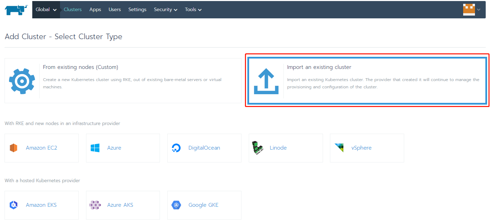

# rancher


## 安装rancher

```bash
sudo docker run -d --name myrancher --restart=unless-stopped -p 8080:8080 rancher/server:stable

docker logs -f --tail 500 dreamy_morse
```


把azure的aks加入rancher中

https://rancher.com/docs/rancher/v2.x/en/cluster-provisioning/hosted-kubernetes-clusters/aks/


## 无法删除namespace，卡在removing

https://github.com/rancher/rancher/issues/14715

```bash
kubectl delete namespace vault --force --grace-period=0

# This is a known issue with removing an imported cluster (and in the process of being fixed) but you can remove it by running kubectl edit namespace cattle-system and remove the finalizer called controller.cattle.io/namespace-auth then save. Kubernetes won't delete an object that has a finalizer on it.

kubectl edit namespace vault
```


## 要删掉一个节点，然后以全新的节点加进来

先drain


然后delete


然后删掉相关路径：

docker inspect nginx-proxy，kubelet，kube-proxy，share-mnt; 

```bash
docker rm -f $(docker ps -q)
docker container prune
docker system prune
sudo rm -r /etc/kubernetes
sudo rm -r /var/lib/etcd
sudo rm -r /var/lib/kubelet
```


然后加进来


## 安装k3os，设置server agent

在virtualBox里启动一个虚拟机，加载K3OS，网卡选择桥接模式，IP和宿主机同一网段，可访问外网

启动，su os-config，配置k3s相关选项之后，在重启之前把ISO镜像下掉

如果是agent，URL of server是这个：

https://k3s-server:6443 （中间换成对应的IP）

token是server里这个文件的最后一段，在配置server的时候可以输入的，如果不输入会自动生成一个很复杂的token

/var/lib/rancher/k3s/server/node-token

在server输入kubectl get nodes，如下所示，则添加agent成功


Done！

TIPS：

1） 如果get nodes之后没有agent，主要看网段是否一致，是否能访问外网，url和token是否正确

## 部署rancher，添加k3s集群

在virtualBox里启动一个虚拟机，加载rancherOS，网卡选择桥接模式，IP和宿主机同一网段，可访问外网

 

安装完系统后，执行如下命令安装rancher服务：

docker run -d --restart=unless-stopped \

 -p 80:80 -p 443:443 \

 -v /var/log/rancher/auditlog:/var/log/auditlog \

 -e AUDIT_LEVEL=1 \

 rancher/rancher:latest

 

安装完成后，浏览器访问[https://rancherOS-IP](https://10.72.0.164/):443，即可进入rancher Web界面

 

添加集群


导入现有集群



输入集群名称，点击创建


在k3s的server节点上执行第三条命令


kubectl create clusterrolebinding cluster-admin-binding --clusterrole cluster-admin --user [USER_ACCOUNT]

 

kubectl apply -f https://172.17.237.236/v3/import/sxhk4sn2txxcjvtz2hx9lqkw2pr4n58gvtgq82cjndblbznf4zjjvh.yaml


curl --insecure -sfL https://172.17.237.236/v3/import/sxhk4sn2txxcjvtz2hx9lqkw2pr4n58gvtgq82cjndblbznf4zjjvh.yaml | kubectl apply -f -


会先变成pending，一分钟后变成waiting，再变成active


Done！

